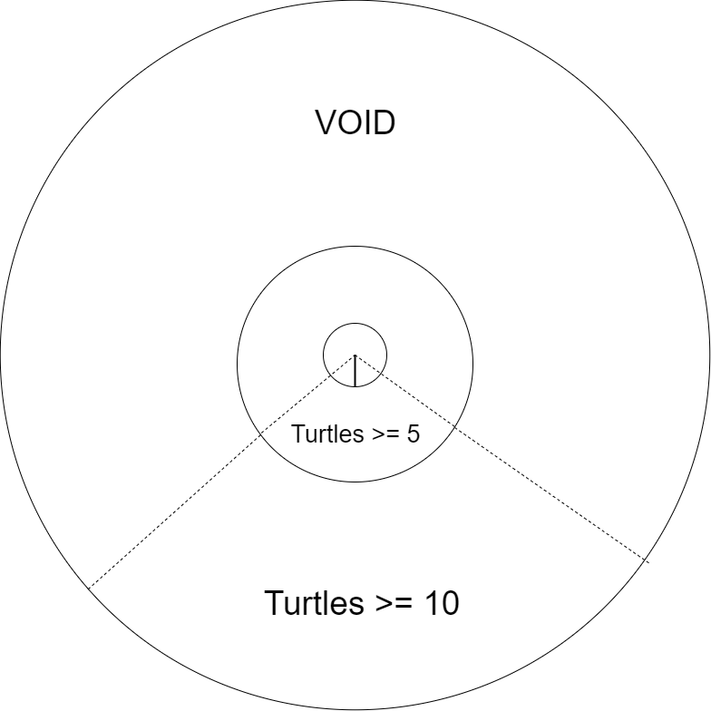
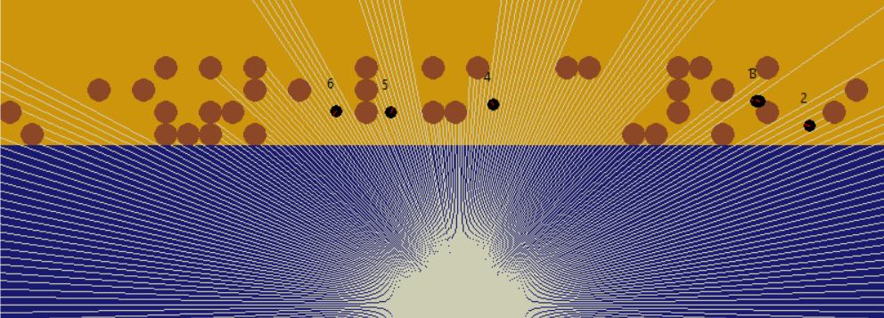
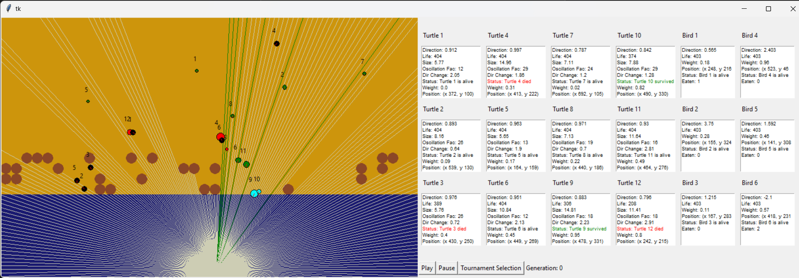
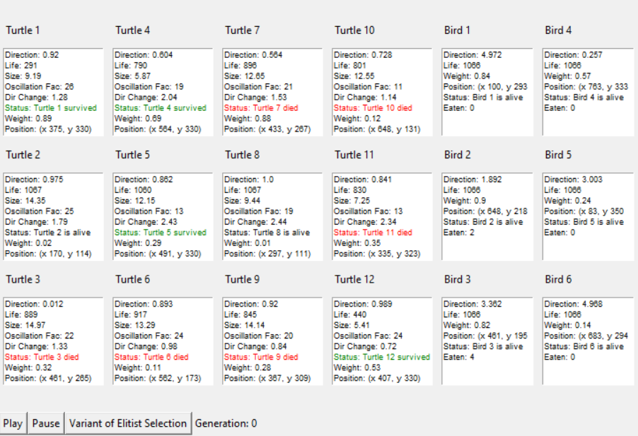

# Genetic Turtle Simulation

This repository contains a simulation project that explores how turtle hatchlings evolve to develop traits that lower mortality rates. The project uses genetic algorithms and simulates environmental challenges, allowing turtle populations to adapt through selection methods.

## Overview

The goal of the project is to develop a simulation that accurately represents the challenges faced by turtle hatchlings, such as predators and environmental hazards. The simulation models evolutionary strategies using **Tournament Selection**, **Steady State Selection**, and **Elitist Selection**. Various sensor techniques and raycasting are also employed to simulate environmental interactions.

## Features

### Evolutionary Algorithms
- **Tournament Selection**: A method of selecting the best-performing turtles from the population to create the next generation.
  
- **Steady State Selection**: Ensures the population evolves gradually, maintaining a stable environment.
- **Elitist Selection**: Ensures the best individuals are carried over to the next generation to preserve optimal traits.
  
  

### Raycasting with Bresenham Line Algorithm
The simulation includes raycasting, implemented using the Bresenham line algorithm. This is used to simulate how light behaves in the environment and how turtle hatchlings detect objects like predators or rocks. Ray intersections are calculated based on quadratic equations to simulate realistic ray-object interactions.



### Environment Simulation
- **Tkinter GUI**: The graphical user interface for the simulation is built with Tkinter, allowing visualisation of the turtle hatchlings and their interactions with the environment.
  
  

- **Challenges**: Due to Tkinter's limitations, performance issues arise with more complex calculations like raycasting. Future implementations could transition to Unity for a more realistic and high-performance environment.

  

### Turtle-Predator Interaction

- The simulation also models the interactions between turtle hatchlings and their predators, as shown in the diagram below.

### Future Implementations
- **Varied beach conditions**: Simulating different environmental factors like temperature to see how they affect survival rates.
- **Predator diversity**: Introducing more types of predators to test how turtles adapt to new challenges.
- **Reproduction simulation**: Using crossover and truncation selection to simulate how advantageous traits propagate within the turtle population.


### `docs/`
- **How Can Turtle-Hatchlings Evolve to Develop Low Mortality Rates.pdf**: A detailed report documenting the research behind the simulation, including the scientific foundation, algorithms, and environment modeling.

## Installation and Setup

1. Clone the repository:
   ```bash
   git clone https://github.com/jes4l/genetic-turtle-sim.git
   ```
2. Install dependencies (tkinter if applicable).
3. Run the simulation through the provided Tkinter interface or extend it using Unity for improved performance.

## Usage

- Adjust the parameters of the genetic algorithms (e.g., mutation rate, selection method) in the simulation to test different evolutionary outcomes.
- Visualise how these changes impact turtle hatchling survival rates, behavior, and interactions with the environment.

## References

For more detailed research and information, refer to the full academic report included in the `docs/` folder.

